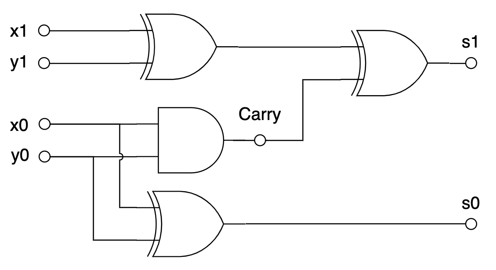
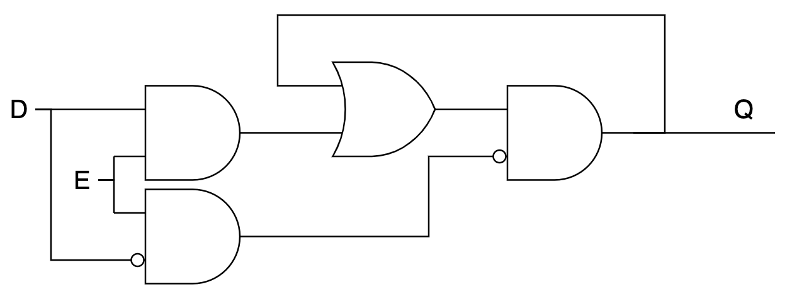

# nand2cpu

Архитектура фон Неймана:

Наша задача: сделать процессор (CPU) — цифровое электронное устройство, способное последовательно выполнять инструкции, хранящиеся в памяти (в том числе: доставать из памяти сами инструкции и данные, обрабатывать данные и записывать их обратно в память, а также взаимодействовать с “внешними устройствами”).

Под “обработкой данных” мы обычно понимаем вычисление каких-нибудь функций (в математическом смысле): например, у нас есть два числа $x$ и $y$, а мы хотим вычислить их сумму $x+y$. Компьютер у нас двоичный, так что целые числа мы представляем в двоичной форме — в виде последовательности нулей и единиц: \\( 14 = 1110_2 \\), а вычисления можно представить в виде логических операций.

План действий: 

1) научиться представлять любые функции в виде *логических схем;*

2) научиться последовательно производить вычисления согласно программе (последовательности инструкций);

3) воплотить всё это в виде электронного устройства.

### Логические схемы

Будем собирать схемы из ограниченного количества *логических элементов*, или *логических вентилей* (logic gates) — можно выбрать, например, такой *базис:*

Сделаем *двухразрядный сумматор* — функцию, которая принимает два одноразрядных числа и возвращает двухразрядное число — их сумму. Напишем сначала таблицу истинности:

| x | y | x+y |
| --- | --- | --- |
| 0 | 0 | 00 |
| 0 | 1 | 01 |
| 1 | 0 | 01 |
| 1 | 1 | 10 |

Первый (старший) бит — это `AND(x, y)`, а второй (младший) — это `XOR(x, y)`. Так и нарисуем:

Теперь усилим эффект и будем складывать два двухразрядных числа:

И так далее. В общем, потратив больше или меньше базисных элементов, можно реализовать любую булеву функцию. Можно, например, сделать арифметико-логическое устройство (АЛУ), которое принимает на вход два числа и номер операции (1 — сложение, 2 —вычитание, 3 — умножение…) и выдаёт на выходе результат.

Конечно, любая физическая реализация такой комбинационной логики будет срабатывать не мгновенно, а с некоторой задержкой. Можно представить себе, как входной сигнал “протекает” через логические вентили: например, если у каждого вентиля задержка $d$, то в предыдущей схеме `s0` будет вычислено с задержкой $d$, а `s1` с задержкой $2d$.

### Синхронизация

Очень неудобно, когда разряды числа оказываются вычислены в разные моменты времени. Хотелось бы научиться в некоторых точках схемы остановиться и подождать, пока какие-то значения не стабилизируются (например, дождать вычисления всех разрядов числа).

Чтобы подождать, нам потребуется некоторое время “помнить” значения в нужных точках схемы. Чтобы добиться такого эффекта, мы выйдем за пределы комбинационной логики (в которой сигнал течёт только “вперёд”) и добавим в схему цикл.

Триггер (SR latch)

Буквы S и R означают Set и Reset. Если подать на входы S=1, R=0, то триггер “запоминает” значение 1; если S=0, R=1, то значение 0; пока S=R=0, триггер находится в самоподдерживающемся состоянии — выход равен “запомненному” значению.

Теперь, чтобы “запереть” триггер, добавим перед ним штуковину, которая может обратить оба входа в ноль:

Синхронный триггер (gated SR latch)

Пока E=0, триггер не изменит своего состояния Q. Осталось от пары сигналов S/R перейти к одному сигналу data — D:

Синхронный D-триггер (synchronous D-latch)

Приделаем такие D-триггеры к нашему сумматору, а на входы E подадим сигнал от *тактового генератора*, который с некоторой периодичностью на короткое время подаёт туда 1:

Сумматор с защёлкой на выходе

Пока тактовый генератор не подал единицу на входы Е, защёлки хранят своё предыдущее состояние (и обеспечивают стабильный вход для последующих комбинационных цепей). Как только он сработает, значения на защёлках сменятся на вновь вычисленные.

Таким образом, вставляя между защёлками комбинационную логику, мы можем сделать *синхронную цепь*, в которой в течение *такта* обновляются значения, которые хранятся на защёлках. *Тактовая частота* должна быть достаточно низкой, чтобы успела стабилизироваться комбинационная логика, но как можно более высокой, чтобы считать побыстрее :-).

### Реализация

[https://habr.com/ru/company/timeweb/blog/653159/](https://habr.com/ru/company/timeweb/blog/653159/)
