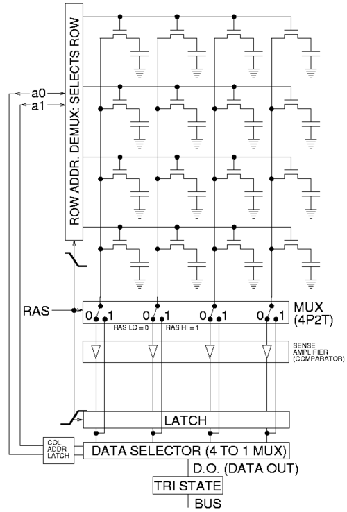

## Обращения к памяти.
Сохранить значение регистра eax по адресу 0x40100,
а потом загрузить обратно в регистр ebx:
```x86asm
    mov %eax, 0x40100
    mov 0x40100, %ebx
```

Как правило, мы используем в качестве адресов метки:
```x86asm
    .global main
main:
    mov x, %eax
    call writei32
    call finish

x:  .int 43
```

Не любой адрес в памяти доступен для чтения и тем более записи:
```x86asm
    .global main
main:
    incl x
    call finish

x:  .int 43
```
При попытке исполнения инструкции `incl` операционная система
остановит программу с сообщением «Segmentation fault»,
поскольку эти данные нельзя менять.

## Секции .data и .bss
Код и данные записываются в одну из *секций* исполняемого
файла. По умолчанию это секция `.text`, в которой
ожидается машинный код и которая недоступна для записи.

Данные можно положить в секцию `.data`:
```x86asm
    incl x

    .data
x:  .int 43

    .text
    call finish
```

Бывают read-only данные (например, тексты сообщений программы),
для них есть секция `.rodata`. Эта секция не имеет собственной
директивы, поэтому нужно воспользоваться директивой `.section`:
```x86asm
    .section .rodata
pi_digits:
    .byte 3,1,4,1,5,9,2,6
```

## Endianness

x86 — little endian:
```x86asm
    // 0x40100:  00 00 00 00  00 00 00 00
    movl $0xabcdef, 0x40100
    // 0x40100:  ef cd ab 00  00 00 00 00
```
Младший байт по младшему адресу в памяти.

## Расширение

```x86asm
    movzbl %al, %edi  // zero-extend, расширение нулями
    movsbl %al, %edi  // sign-extend, расширение знаковым битом
    cdq  // sign-extend eax to edx:eax
```

В синтаксисе Intel —
[movzx](https://www.felixcloutier.com/x86/movzx),
[movsx](https://www.felixcloutier.com/x86/movsx).

## Разные способы адресации в x86

```x86asm
    mov x + 4, %eax   // прямая адресация
    mov $x, %esi      // положили в esi адрес массива x
    mov 4(%esi), %eax // косвенная адресация

    mov $17, %edi

    // загружаем в eax 18-й элемент массива
    // (адрес которого %esi + %edi*4)
    mov (%esi, %edi, 4), %eax

    .bss
x:  .skip 4 * 100

x5: .int x + 4*5      // в x5 лежит адрес шестого элемента массива x
```

Общий вид обращения к памяти:

`OFFSET(BREG, IREG, SCALE)`

Здесь OFFSET — непосредственно заданное смещение,
BREG — базовый регистр, IREG — индексный регистр,
умножаемый на SCALE (SCALE может быть 1, 2, 4 или 8).

Итоговый адрес (effective address) вычисляется по формуле:

`BREG + OFFSET + IREG * SCALE`

## Стек
Writable область памяти, которая используется
как стек. Стек на x86 растёт *вниз* (от старших адресов к младшим).
На верхушку стека (первый занятый байт) указывает регистр esp.

Скопировать верхушку стека (первые 4 байта) в регистр `eax`:
```x86asm
    mov (%esp), %eax
```

Для того, чтобы класть данные на стек и выталкивать их оттуда,
есть специальные инструкции:
```x86asm
    push %eax  // то же, что sub $4, %esp; mov %eax, (%esp)
    pop %eax   // то же, что mov (%esp), %eax; add $4, %esp
```

Инструкция `push` одна из немногих, которые могут обратиться
к двум адресам памяти сразу:
```x86asm
    .data
x:  .int 1900

    .text
    pushl x  // взять 4 байта из памяти по адресу x
             // и положить их в стек, то есть тоже в память
```

Можно пользоваться памятью выше `esp`, если вы знаете,
что там что-то есть. Например, если вы положили в стек
два 32-битных числа, их можно оттуда читать и там изменять:
```x86asm
    pushl $6
    pushl $7

    // теперь стек выглядит так:
    //    07 00 00 00  06 00 00 00 ...
    //    ↑ esp

    mov 4(%esp), %eax  // загрузили в %eax число 6
    incl (%esp)        // теперь на верхушке стека лежит число 8
```

Память *ниже* `esp` использовать не следует.

Инструкция `push %esp` кладёт на стек
то значение `esp`, которое было до её исполнения
(не уменьшенное на 4).


## Подпрограммы

Когда в ДЗ просят сдать «функцию» или «подпрограмму»:
1) исполнение начинается с метки с именем подпрограммы;
2) метка должна быть `.global`;
3) чтобы вернуть управление в проверяющую программу,
   используйте инструкцию `ret`;
4) если меняете значения регистров, кроме `eax`, `ecx` и `edx`,
   сохраняйте их в стек и потом восстанавливайте.

Например, если вас просят написать функцию `foobar`,
и вам нужно менять регистры `esi` и `edi`:
```x86asm
    .global foobar
foobar:
    push %esi
    push %edi
    ... // делаем что просят, можем портить esi и edi
    pop %edi // восстанавливаем в обратном порядке
    pop %esi
    ret
```
(Подробнее в следующей лекции.)

## Устройство ОЗУ
Мы уже видели SRAM — память на триггерах.

Основную часть памяти компьютера составляет DRAM:


Процессор и память общаются посредством *шины* (bus):

