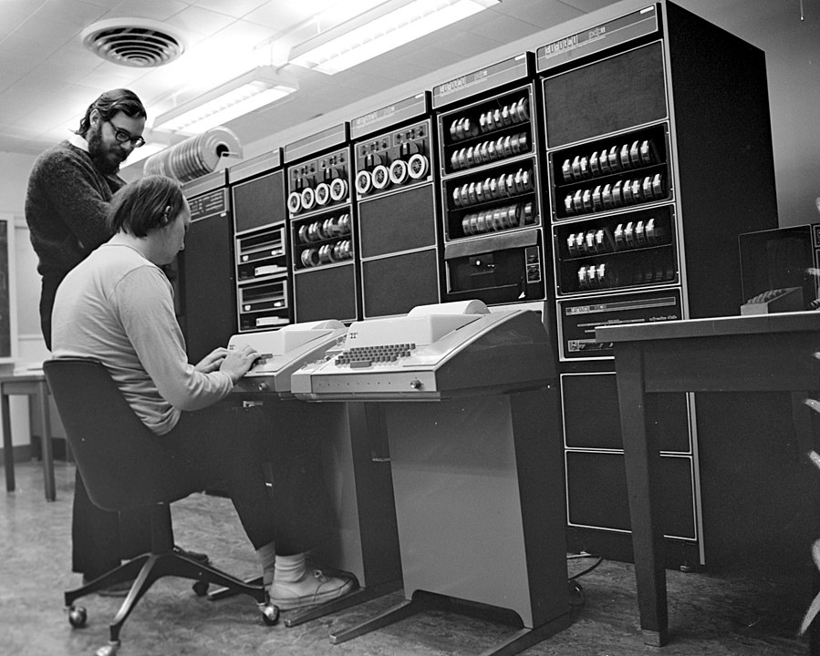

# Язык Си
## История

Кен Томпсон и Деннис Ричи у PDP-11

[Википедия про историю языка Си](https://en.wikipedia.org/wiki/C_(programming_language)#History)

Мы используем стандарт С11 (прошлые стандарты: C89, C99; грядёт стандарт C23).

[Черновик стандарта](https://www.open-std.org/JTC1/SC22/WG14/www/docs/n1570.pdf) (сам стандарт
можно купить у ISO за большие деньги,
там написано то же самое.)

## Что регулирует стандарт
* Implementation-defined behavior
  * Пример: представление целых чисел
* Unspecified behavior 
  * Пример: порядок вычисления аргументов
при вызове функции
* Undefined behavior (UB)
  * Пример: выход за границы массива

[Статья про то, зачем нам нужен UB](https://www.ralfj.de/blog/2021/11/18/ub-good-idea.html)

```c
*p = 1;
if (!p) {
    fprintf(stderr, “NULL pointer\n”);
    return;
}
```

## Целые типы
```c
char        signed char         unsigned char
short     = signed short        unsigned short
int       = signed int          unsigned int
long      = signed char         unsigned char
long long = signed long long    unsigned long long
```

* CHAR_BIT >= 8
* sizeof(char)== 1
* sizeof(signed T) == sizeof(unsigned T) == sizeof(T)
* short как минимум 16 бит
* int как минимум 16 бит
* long как минимум 32 бита
* long long как минимум 64 бита
* <stdint.h>: intN_t, uintN_t
* <inttypes.h>: I/O макросы

sizeof для типов:
```c
Тип       Atmel AVR  32-bit  Win64  64-bit
char      1          1       1      1
short     2          2       2      2
int       2          4       4      4
long      4          4       4      8
long long -          8       8      8
__int128  -          -       -      16
```

```c
#include <limits.h>
CHAR_MIN, CHAR_MAX, SCHAR_MIN, SCHAR_MAX,
UCHAR_MIN, ..., INT_MIN, INT_MAX, UINT_MAX,
LONG_MIN, LONG_MAX, ULONG_MAX, LLONG_MIN,
LLONG_MAX, ULLONG_MAX
```

Заголовочный файл `<stdint.h>`:
* Знаковые типы: `int8_t, int16_t, int32_t, int64_t`
* Беззнаковые типы: `uint8_t, uint16_t, uint32_t, uint64_t`
* Типы размера, достаточного для хранения
  адреса в памяти: `intptr_t, uintptr_t`

Литералы:
```c
0   // int
0U  // unsigned
0UL // unsigned long
0LL // long long
```

## Знаковая и беззнаковая арифметика
Unsigned – по модулю \\(2^N\\).

Signed – операции с неправильным ответом, как правило, UB.

```c
    UINT_MAX + 1;  // OK, always 0
    INT_MAX + 1;   // UB
    int i;
    i < i + 1;     // always true
```

Опции gcc:
* `-ftrapv` – abort() при знаковом целочисленном
переполнении
* `-fwrapv` – выполнять знаковые операции по
модулю 2^N, но компилятор не делает
никаких оптимизационных предположений
* `-fsanitize=undefined` – частичная проверка на undefined
behavior при работе программы

Integer promotion.

[GCC built-in overflow detection](https://gcc.gnu.org/onlinedocs/gcc/Integer-Overflow-Builtins.html)

## Структура программы

Declarations and definitions

Translation unit

Extern, static

## Агрегатные типы

Arrays and structures

Aggregate initializers

Array dimensions

Pointer arithmetic

Typedef

Alignment

## Другие темы

Hosted vs freestanding

Stdio

Argc/argv

Strings

Restrict

Noreturn etc

VLA

Function pointers
