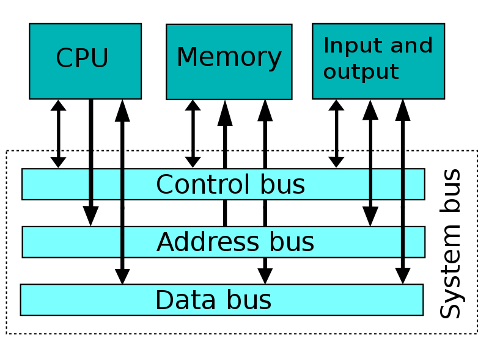

## Операционная система

Комплекс программ.

Организует доступ к ресурсам ЭВМ:
* унифицирует,
* разграничивает,
* мультиплексирует,
* учитывает и квотирует.

Для всего этого требуется привилегированный режим
работы процессора.
Часть ОС, использующую этот режим, принято называть *ядром*
(kernel).

Ядро бывает:
* монолитное,
* модульное (например, Linux),
* микроядро (microkernel).

## Взаимодействие с устройствами

Memory-mapped и port-mapped IO.



Например, видеопамять 

Работа с портами: инструкции [in](https://www.felixcloutier.com/x86/in), [out](https://www.felixcloutier.com/x86/out).

Например, VGA использует, кроме прочих, порты 0x3d4 и 0x3d5.

Polling.

## Загрузка компьютера с BIOS
(сейчас на вашем x86-совместимом компьютере UEFI, но идея та же)

Часть адресов RAM отображена на ROM, где лежит firmware.

[Структура адресуемой памяти x86](https://wiki.osdev.org/Memory_Map_(x86))

При включении компьютера процессор работает в режиме совместимости
с IBM PC (16-битный *real mode*), исполнение начинается
по адресу 0xFFFF0 (*reset vector*).

### Сегментная модель памяти :-(

IBM PC мог адресовать 1 MB памяти (20-битная шина адреса),
а регистры были 16-битные.

Сегментные регистры: `cs`, `ds`, `es`, `ss` (`fs`, `gs` в 32-битном режиме).

Каждое обращение к памяти происходит по адресу из двух частей:
сегментные регистр и смещение. Физический адрес равен `16 * seg + offset`.

```x86asm
    mov [ds:ax], 42  // обращение к памяти по адресу 16 * ds + ax
```

### Загрузка с диска
BIOS инициализирует и тестирует оборудование компьютера,
а затем читает с загрузочного диска первый *сектор* (512 байт)
и передаёт ему управление.

## Учебная ОС yabloko
[Гитхаб](https://github.com/hse-cs-ami/yabloko-public).

`-ffreestanding`
