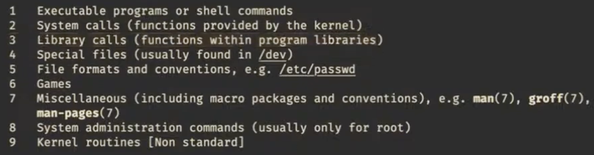
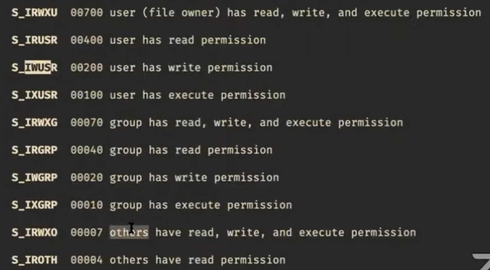
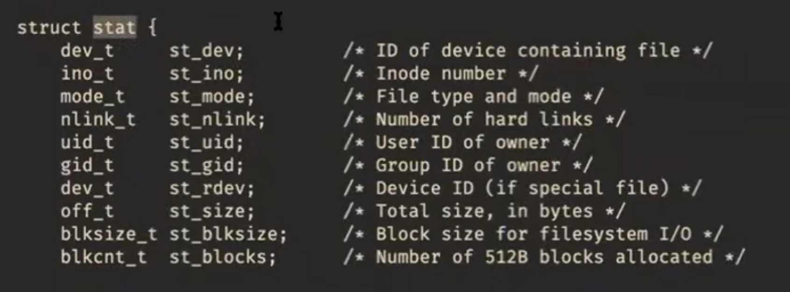
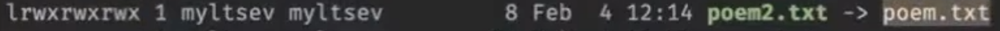
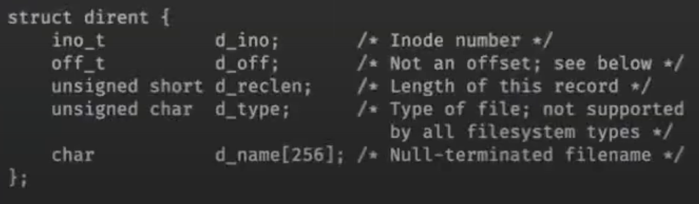
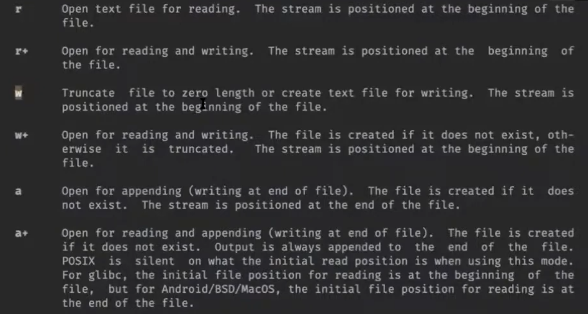

## Семейство юниксовых
Картинка из Википедии:


В 70-х Кен Томсан и Деннис Ричи разработали ОС Research UNIX. В 80-е AT&T ее коммерциализировала. В это же время Ричард Столлман придумал проект GNU, для него не хватало ядра. В 90-е Линукс Торвальс начал разрабатывать Linux, проект GNU его подхватил. Теперь мы пользуемся ОС GNU/Linux, название означает OC GNU и ядро Linux. 

Все это развивалось в разных направлениях, переносить программы между разными юниксами было тяжело, были попытки обеспечить переносимость программ между разными юниксами. В 1988 рабочая группа IEEE выпустила первый стандарт POSIX (portable operating system interface), который стандартизировал, что такое UNIX.

В 1994 компания AT&T специализировала свою версию POSIX в документе Single UNIX Specification (SUS).

## Файлы
Главная сущность, которую мы будем изучать - файлы, поскольку в unix-подобных системах почти все является файлами. Мы будем работать с ними посредством системных вызовов.

Файл — последовательность байт, к которой ОС предоставляет
доступ посредством *файловых операций*.

Например:
* файл на диске;
* вывод программы;
* пользовательский ввод;
* последовательность случайных чисел;
* всё содержимое диска;
* ...


```
    ───────────────────────────
... Mary had a little lamb, its ...
    ───────────────────────────
          ▲
          │ file position

read(1) → "a"
read(5) → "d a l"
read(5) → "ittle"
write(5, " wolf")

    ───────────────────────────
... Mary had a little wolf, its ...
    ───────────────────────────
                          ▲
                          │
```

Заметим, что системные вызовы write/read могут не иметь смысла при работе с конкретным файлом. Например, в файл “пользовательский ввод” нельзя ничего записать или подвинуть позицию чтения/записи.

Конец файла (EOF):

```
    ─────────────────────────┐
... il sole e l'altre stelle.│
    ─────────────────────────┘
                      ▲
                      │

read(10) → "stelle."
read(10) → ""
write(5, " FIN.")

    ──────────────────────────────┐
... il sole e l'altre stelle. FIN.│
    ──────────────────────────────┘
                                  ▲
                                  │
```

> Q. А как пользователь понимает, где EOF?
> 

> A. EOF - ситуация, она нигде. EOF (end of file) -  это не специальный символ, а ситуация, когда после запроса на считывание байтов считывается 0 байт.
> 

## Файловые дескрипторы

Операции для работы с файлами - это системные вызовы, то есть обращения к ядру. Чтобы объяснить ядру, какими из файлов мы хотим работать, нужны идентификаторы. В качестве идентификаторов выступают файловые дескрипторы. Они выглядят, как целые числа.

```
               char buf[10];
               int fd = 3;
               read(fd, buf, sizeof(buf));
Userspace
──────────────────────────────────────────
Kernelspace
               0 → user input
               1 → terminal
               2 → terminal
               3 → somefile.txt
```


* 0 (`STDIN_FILENO`) — standard input
* 1 (`STDOUT_FILENO`) — standard output
* 2 (`STDERR_FILENO`) — standard error output 

> Q. Для разных процессоров разные дескрипторы?
> 

> A. Да, у каждого процессора есть собственная таблица файловых дескрипторов.
> 


## Системные вызовы

> Подробнее про системные вызовы можно прочитать в руководстве. В нем есть разные секции.
> 



Секции нужны, чтобы различать разные сущности с одинаковыми названиями. Например, есть read - инструкция командного интерпретатора. Также есть read для работы с файлами, он лежит во второй секции. Вызвать нужное руководство можно в терминале вот так: `man 2 read`

### Системные вызовы read и write

```c
#include <unistd.h> // расшифровывается как unix standart

ssize_t read(int fd, void *buf, size_t count); // ssize_t - знаковый size_t, нужен, чтобы помещалось значение -1
ssize_t write(int fd, const void *buf, size_t count);
```

- если считывание прошло успешно, read возвращает количество считанных байт (0, если достигли конца файла)
- если произошла ошибка, read возвращает -1, а также выставляет специальную переменную `errno`. В `errno` хранится номер последней произошедшей при системных вызовах ошибки

> Напишем программу mycat, которая будет читать байты со стандартного входа и писать их на страндартный выход с помощью системных вызовов
> 

```c
#include <unistd.h>

int main() {
    char c; // наш буфер в один байт
    while (read(STDIN_FILENO, &c, sizeof(c)) > 0) { // STFIN_FILENO = 0
        write(STDOUT_FILENO, &c, sizeof(c)); // STDOUT_FILENO = 1
    }
}
```

Чтобы сделать конец файла, нажмем ctrl + d. Так драйвер терминала порождает конец файла.

> Q. Получается, ядро считывает ввод до \n?
> 

> A. Да. Это можно поменять с помощью драйвера терминала.
> 

Команда strace показывает, какие системные вызовы совершает наша программа. Использовать вот так: `strace ./mycat`

Наш буфер сейчас 1 байт. Если файл очень большой, то программа будет работать долго, поскольку системные вызовы являются программными прерываниями. Давайте увеличим буфер, в который читаем файл.

> Q. Не получится ли плохая ситуация, когда в файле осталось читать только 100 байт, а мы просим 200?
> 

> A. Нет, когда мы просим считать больше байтов, чем осталось на чтение в файле, read считывает, сколько есть.
> 

### Системный вызов o**pen**

```c
int open(const char *pathname, int flags);
int open(const char *pathname, int flags, mode_t mode);
```

- Если файл удалось открыть, `open` возвращает файловый дескриптор
- Если не удалось, `open` вернет -1, а также выставит номер ошибки в errno

Заметим, что приведены две функции open с разными сигнатурами. Язык С так не умеет, на самом деле функция open принимает произвольное количество параметров.

> Напишем программу, которая умеет работать с аргументами командной строки
> 

```c
#include <unistd.h>
#include <sys/types.h>
#include <sys/stat.h>
#include <fcntl.h>
#include <stdio.h>
#include <stdlib.h>

void catfile(int sourcefd) {
    char buf[10000];
    ssize_t result;
    while ((result = read(sourcefd, buf, sizeof(buf))) > 0) {
        write(STDOUT_FILENO, buf, result);
    }
}

int main(int argc, char *argv[]) {
    if (argc == 1) {
        catfile(STDIN_FILENO);
    } else {
        for (int f = 1; f < argc; ++f) {
            int fd = open(argv[f], O_RDONLY); // в argv[f] путь к файлу
            if (fd < 0) {
                perror("error opening file"); // print error, лежит в <stdio.h>. принимает строку, печтает ее и сообщение об ошибке, исходя из errno
                return EXIT_FAILURE;  // EXIT_FAILURE = 1
            }
            catfile(fd);
            close(fd);  // всего 1024 доступных файловых дескрипторов, хочется избежать, чтобы при каждом open давали новый файловый дескриптор
        }
    }
}
```

> Q. Функция `_start` тоже принимает на вход аргументы командной строки?
> 

> A. Да, но в стеке.
> 

## **Флаги**

- Режима доступа к файлу: O_RDONLY, O_WRONLY и O_RDWR
- O_TRUNC обрезает файл, при открытии он получит размер 0
- O_CREAT создаст файл, если его нет
- O_APPEND установит файловую позицию чтения/записи на конец файла

### **Системный вызов lseek**

```c
off_t lseek(int fd, off_t offset, int whence);
```

*offset* - на сколько байт перемотать относительно точки отсчета

*whence* - точка отсчета:

- `SEEK_SET` - с начала файла
- `SEEK_CUR` - с текущей позиции
- `SEEK_END` - с конца файла

> Напишем программу, которая перематывает файл на какую-то позицию и там что-то записывает
> 

```c
#include <unistd.h>
#include <fcntl.h>
#include <stdio.h>
#include <stdlib.h>
#include <string.h>

const char usage[] = "Usage: binpatch FILE OFFSET DATA\n";

int main(int argc, char *argv[]) {
    if (argc != 4) {
        write(STDERR_FILENO, usage, strlen(usage));
        return EXIT_FAILURE;
    }

    const char *name = argv[1];
    int offset = atoi(argv[2]);
    const char *data = argv[3];

    int fd = open(name, O_WRONLY | O_CREAT, S_IWUSR | S_IRUSR); // если передать название несуществующего файла, то откроется с флагом O_CREAT
    if (fd < 0) {
        perror(name);
        return EXIT_FAILURE;
    }

    if (lseek(fd, offset, SEEK_SET) < 0) {
        perror("seek");
        return EXIT_FAILURE;
    }
    
    if (write(fd, data, strlen(data)) < 0) {
        perror("write");
        return EXIT_FAILURE;
    }

    off_t position = lseek(fd, 0, SEEK_CUR);  // lseek возвращает смещение от начала записи после исполнения
    ftruncate(fd, position);  // обрезает файл
    // можно не закрывать файл, поскольку мы выходим из программы, и ОС подчистит все наши файловые дескрипторы 
}
```

- Если в пустом файле сдвинуть позицию на 5 байт и записать туда 3 байта, то размер файла станет 8, первые 5 байт заполнятся нулями
- `/dev/stdin` для каждого процессора показывает его стандартный вход, в этом файле нельзя переставить позиции чтения и записи. Если передать этот файл в нашу программу, словим ошибку ESPIPE (illegal seek).

## **Ассемблерные вставки**

В 32-битном Linux системные вызовы реализованы посредством программного прерываения 128, который принимает параметры в регистрах общего назначения, поэтому системные вызовы можно заменить на ассемблерные вставки.

```c
#include <sys/syscall.h>  // тут лежат номера системных вызовов, можем использовать номера системных вызовов как SYS_"название системного вызова"

ssize_t myread(int fd, void* buf, size_t count) {
    ssize_t result;
    asm volatile("int $0x80" : "=a"(result) : "a"(SYS_read), "b"(fd), "c" (buf), "d"(count));
    return result;
}
```

> Q. Программное прерывание 129 ничего не делает?
> 

> A. Оно для нас запрещено. Получим Segmentation fault (core dumped), если его вызовем
> 

## Права доступа

Linux - многопользовская система, поэтому она организует разделение доступов для пользователей. Если набрать `ls -l` в терминале, то увидим файлы, а также пользователя, группу и права доступа для каждого файла.

Права доступа записываются в виде трех троек бит. Первая тройка обозначает, что может делать с файлом владелец, вторая тройка - пользователь, входящий в группу, третья тройка - все остальные. Буквы обозначают следующее: r - право читать, w - записывать, x - исполнять как программы.


Режимы доступа можно задавать самим, когда файл создается. Мы делали это в нашей прошлой программе:

```c
int fd = open(name, O_WRONLY | O_CREAT, S_IWUSR | S_IRUSR); // S_IWUSR и S_IRUSR - макросы на восьмиричные числа, которые обозначают биты защиты 
```



> Посмотреть всех пользователей можно `less /etc/passwd` , а группы `less /etc/group`
> 

### **Системный вызов stat**

```c
int stat(const char *pathname, struct stat *statbuf); // stat - структура с информацией о файле
```



Введя в терминал `stat filename`, можем получить информацию о размере файла, количестве блоков в нем, размере одного блока, времени доступа и др.


## **Разные сущности файлов**

- Обычные файлы - последовательности байт
- Директории, в которых лежат другие файлы и директории
- Символические ссылки
- Жесткие ссылки
- Каналы
- Блочные устройства. Например, диск, куда можно писать блоками
- Символьные устройства. Например, терминал, куда можно читать и писать по одному символу

**Символическая ссылка** — специальный файл, который содержит путь к другому файлу. Когда программа открывает символическую ссылку, она не показывает содержимое файла, а открывает файл с названием, которое там записано. Если переименуем файл, на который указывает ссылка, то символическая ссылка не будет никуда показывать. `ln -s poem.txt poem2.txt` создаст символическую ссылку:



Все файлы на диске имеют номера, записанные в Inode. **Жесткая ссылка** появляется, когда разные имена файлов указывают на один Inode. `ln mary.txt poem.txt` создаст жесткую ссылку. mary.txt укажет на тот же Inode, что и poem.txt, и любые изменения в одном файле приведут к изменениям в другом. Если удалить один из файлов, то второй файл останется.

На Inode есть reference counter, показывающий, сколько имен ссылаются на это содержимое. Когда reference counter = 0, ОС удаляет файл. Если открыть файл, то его reference counter на это время увеличится.

```c
int stat(const char *file_name, struct stat *buf);
int lstat(const char *pathname, struct stat *statbuf);
int fstat(int fd, struct stat *statbuf); // Для работы с открытым файлом с помощью файлового дескриптора, а не пути
int unlink(const char *pathname); // Удаляет связь с Inode. Если pathname - последнее имя, которое указывало на Inode, то Inode удалится
```

Утилита `stat` дает нам информацию о типе файла. Если в `stat` передать имя символической ссылки, то вместо нее ОС подставит тот файл, на который указывает ссылка. Поэтому, чтобы узнать, является ли файл символической ссылкой, используем вызов `lstat`, который работает как `stat`, но передает информацию о самой символьной ссылке, не производя замену.

## **Директории**

Познакомимся с системными вызовами для работы с директориями.

```c
DIR *opendir(const char *name);
DIR *fdopendir(int fd);
struct dirent *readdir(DIR *dirp); // возвращает 0, если дошли до конца директории
```

В структуре dirent можно посмотреть inode number, имя, тип файла и др.



> Напишем программу myls, которая отображает содержимое некоторой директории
> 

```c
#include <dirent.h>
#include <stdio.h>

int main(int argc, char *argv[]) {
    const char *dirname = argv[1];
    DIR *d = opendir(dirname);
    struct dirent *ent;
    while ((ent = readdir(d))) {
        char buf[4096];  // чтобы записывать длинное имя файла
        snprintf(buf, sizeof(buf), "%s/%s", dirname, ent->d_name);
        printf("%s\n", buf);
    }
}
```

```c
int link(const char *oldpath, const char *newpath); // делает ссылки
int symlink(const char *target, const char *linkpath); // делает символические ссылки
```

## **Переносимость в языке си**

Если мы хотим, чтобы наши программы были переносимы, то пользоваться вызовами, которые стандартизированы POSIX, нельзя. Поэтому язык С предоставляет стандартизированные способы работы с файлами.

```c
#include <stdio.h>

FILE *fopen(const char *pathname, const char *mode);
```

- при успехе возвращает указатель на структуру FILE
- при ошибке возвращает NULL и выставляет номер ошибки в errno

Заметим, что `mode` передаем как символьную строку, она может принимать следующие значения:



Перенос строки `\n` в UNIX-подобных ОС - это символ с кодом 10, а на Windows перевод строки - это символы CR и LF (коды 13 и 10). Ради переносимости язык C работает с текстовым файлами так, чтобы `\n` превращался в тот символ переноса, что нужен на конкретной платформе. Эту опцию можно отключить, добавив в конце `mode` букву b.

```c
// другие функции библиотеки С для работы с файлами

int fclose(FILE *stream);
int fprintf(FILE *stream, const char *format, ...);
int fseek(FILE *stream, long offset, int whence);
```

Стандартная библиотека языка С создает потоки ввода/вывода буферизованными: данные накапливаются в буфере, пока он не заполнится. Только тогда данные передаются в системный вызов write.

```c
#include <stdio.h> 
#include <unistd.h>

int main() {
    FILE *f = fopen("poem. txt", "w");
    fprintf(f, "some string");
    fprintf(f, " and some other string\n");
    pause();
    fclose(f);
}
```

Если во время выполнения `pause` убить программу, то в файл poem.txt ничего не запишется. Чтобы принудительно очистить буфер, нужно написать `fflush(f)` перед `pause`. Если убрать `pause` и не закрывать файл, то данные все равно окажутся на диске, т.к. когда завершается `main`, стандартная библиотека языка С вызывает функцию `exit`, которая закрывает все потоки ввода и вывода, очищая их буферы.

Но нам не всегда хочется при завершении программы закрывать потоки, поэтому можно самим вызвать системный вызов exit:

```c
syscall(SYS_exit, EXIT_SUCCESS);
```

```c
void _exit(int status); // функция в POSIX. завершает программу, но не сбрасывает буфер
void _Exit(int status); // аналогичная функция в стандартной библиотеке си
```

Бывают потоки, буферизованные построчно. Например, стандартные потоки ввода/вывода. При встрече `\n` они сбрасывают буфер. `stderr`, напротив, не буферизован, благодаря этому сообщения об ошибках появляются сразу.

```c
void setbuf(FILE *stream, char *buf); // для управления буферизацией
void setlinebuf(FILE *stream); // для строчной буферизации
```